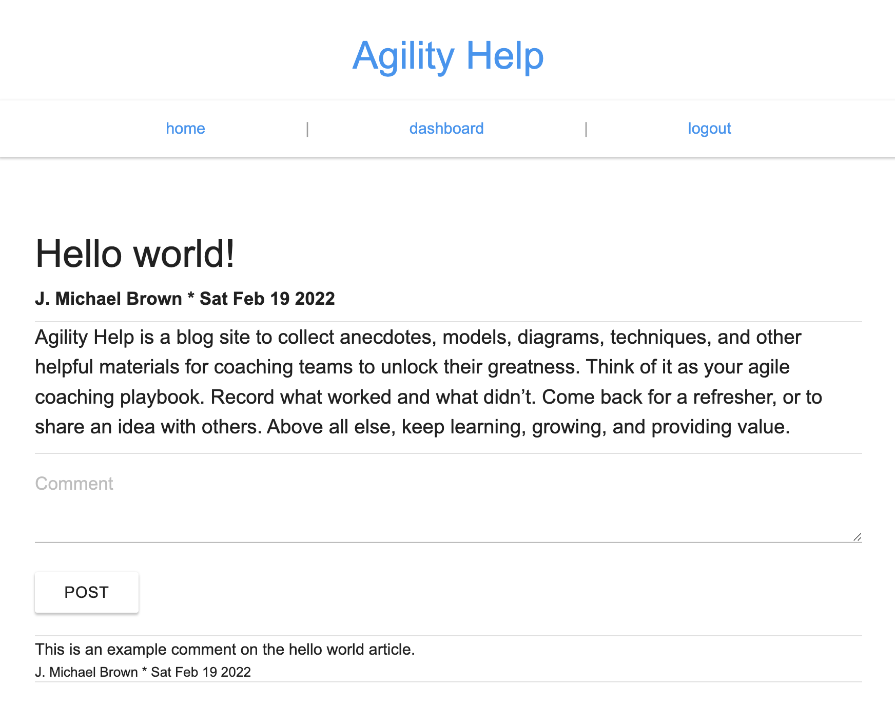

# 📰 agility-help

This is an agile software development focused blog CMS, built from scratch with a handlebars front end, node back end, and mysql database.

The code is structured like a typical MVC application with sequelize/mysql to set up the model, handlebars as the view engine, and express/nodejs as the controller.

You can reach the deployed site at https://agility-help.herokuapp.com/

## Prerequisites

- NodeJS
- MySQL

## Libraries

- express
- sequelize
- mysql2
- bcrypt
- handlebars

## Setup

Be sure to enclude a `.env` file in the root of the project to store your personal mysql details like so:

```
DB_NAME=blog_db
DB_USER=[your_username]
DB_PASSWORD=[your_password]
SESSION_SECRET=[your_secret]
```


